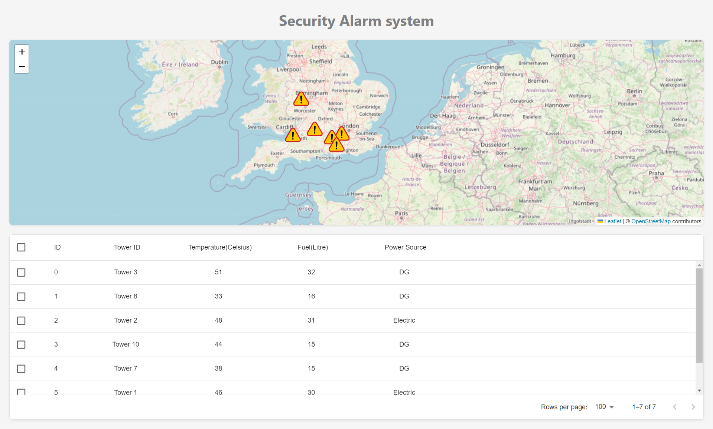
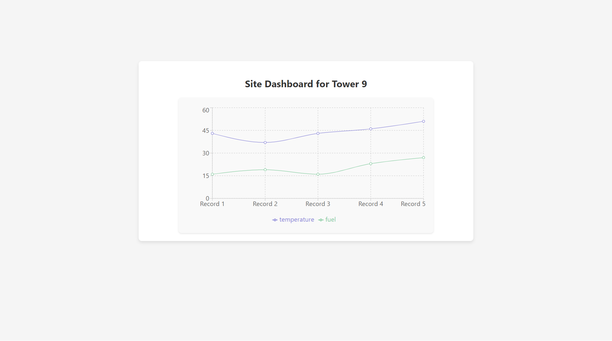

# Anomalies Geo Map

This project is a guide on how to install and run the Anomalies Geo Map application.

## Installation

First, you need to clone the repository and install the dependencies. You can do this by running the following commands in your terminal:

```bash
npm install
cd anomalies-geo-map/
npm install
```

## Starting the Frontend

To start the frontend of the application, navigate to the `anomalies-geo-map/` directory and run:

```bash
npm start
```

## Starting the Backend

To start the backend services, you will need to run the producer and consumer scripts. First, navigate back to the root directory of the project, then run:

```bash
cd ..
node producer.js
node consumer.js
```

Ensure that you have Node.js installed on your machine to run these commands.

## Security Alarm System


## Site Dashboard for Tower 9



